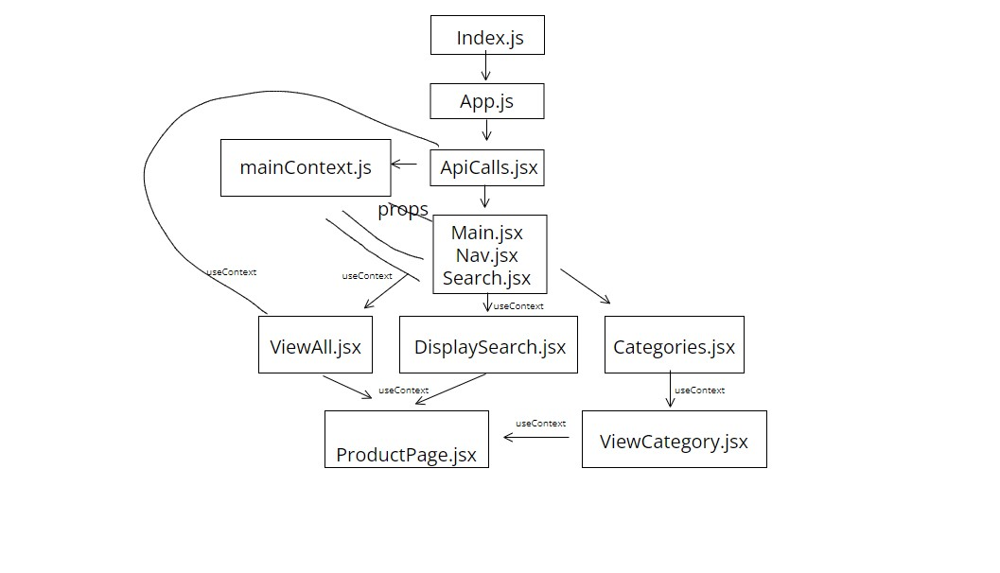

# Jungle Retail Store
---
## This project was created with React

---
## Jungle is a mock retail App, made to resemble Amazon.
## Features include
- Home Page
- View All Products Page
- Search Bar / Display Search Page
- Shopping Cart
- Login/Signup
- Styling Design to Match Jungle Theme
## Home page
---
## Description
The user enters on the Home page with the capability of searching for a product or catagory directly from the navigation bar. Site features a login/signup option for returning or new users to store their shopping data.  Users can view their shopping cart to see which products they have chosen to purchase. On the home page, a few tile options display products from a handful of retail catagories.

## This project is dynamically scaled from cellphone up to desktop

## Contributions

Erik - Git Czar, Main page, search bar, navbar and ensuring all code works together
Quenton - Categories and Display Search
Sarah - View all and Product Page

All three of us contributed to the readme

## Hooks used

 - useState
 - useContext
 - useNavigate
 - useEffect
 - useRef

 

 ## Dependencies

  - axios
  - Routes
  - Route
  - Link
  - React
  - Router
  - ReactDOM

 ## API Calls

 API calls were made using axios and https://dummyjson.com/ API
 API Documentation https://dummyjson.com/docs/products

 

 ## Hierarchy

 

## View All
---
Another web page shows the user all catagories of items available for purchase. Some of these include electronics, clothing, jewelry, or furniture.
## Product Page
Each product has its own page which includes product details. For example, details include the image, price, and brand.
